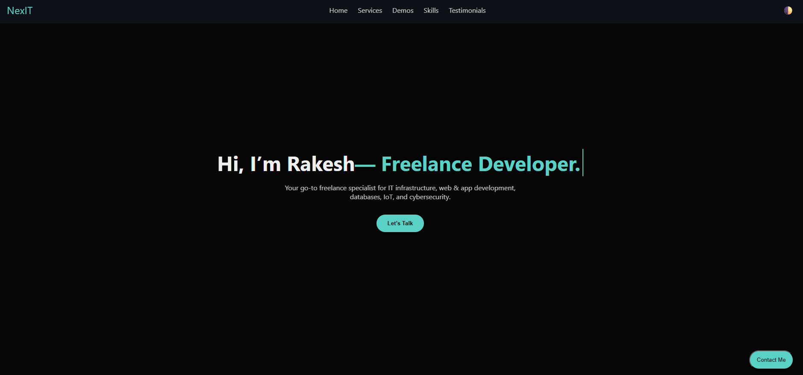
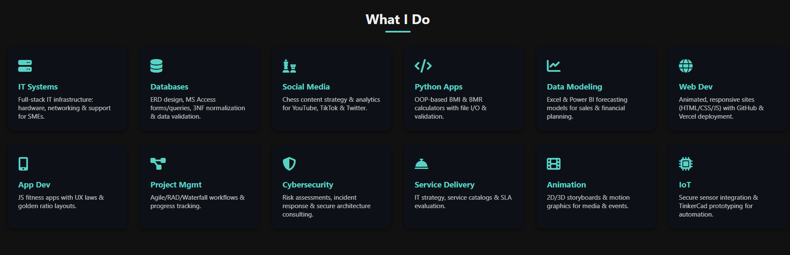

# NexIT Portfolio Website

Welcome to **NexIT**, my personal portfolio website showcasing freelance IT & web solutions. Everything is contained in a single `index.html` file for simplicity and ease of deployment.

---

  
*Figure 1. NexIT homepage screenshot.*

  
*Figure 2. What I do.*

---

## 🚀 Features
- **Hero Section** with typing animation  
- **Service Cards**: 12 core offerings (IT systems, databases, social media, Python apps, data modeling, web & app dev, project management, cybersecurity, animation, IoT)  
- **Live Demos**: Embedded iframes for Productivity OS and EnergyForce  
- **Skills**: Animated proficiency bars (HTML, JS, Python, SQL, UX/UI)  
- **Testimonials Slider**: Auto‑rotating client quotes  
- **Theme Toggle**: Dark/light mode switch  
- **Contact Modal**: Email form powered by `mailto:`  
- **Smooth Scroll & Scroll‑Reveal** animations  

---

## 🛠️ Tech Stack
- **HTML5** & **CSS3** (Flexbox, Grid) — all inline in `index.html`  
- **JavaScript** (ES6+, DOM API) — embedded in `index.html`  
- **Font Awesome** for icons  
- **Vercel** & **GitHub Pages**–ready deployment  

---

## 📁 Project Structure
nexit/
└── index.html # All markup, styles, and scripts in one file


---

## 🔧 Installation & Local Development
1. **Clone the repo**  
   ```bash
   git clone https://github.com/your‑username/nexit.git
   cd nexit
